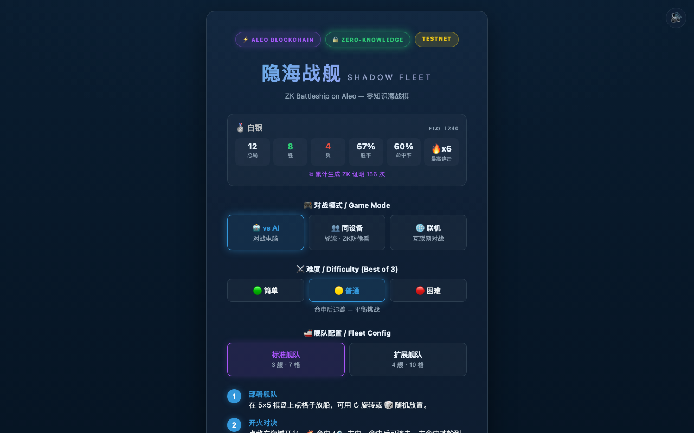
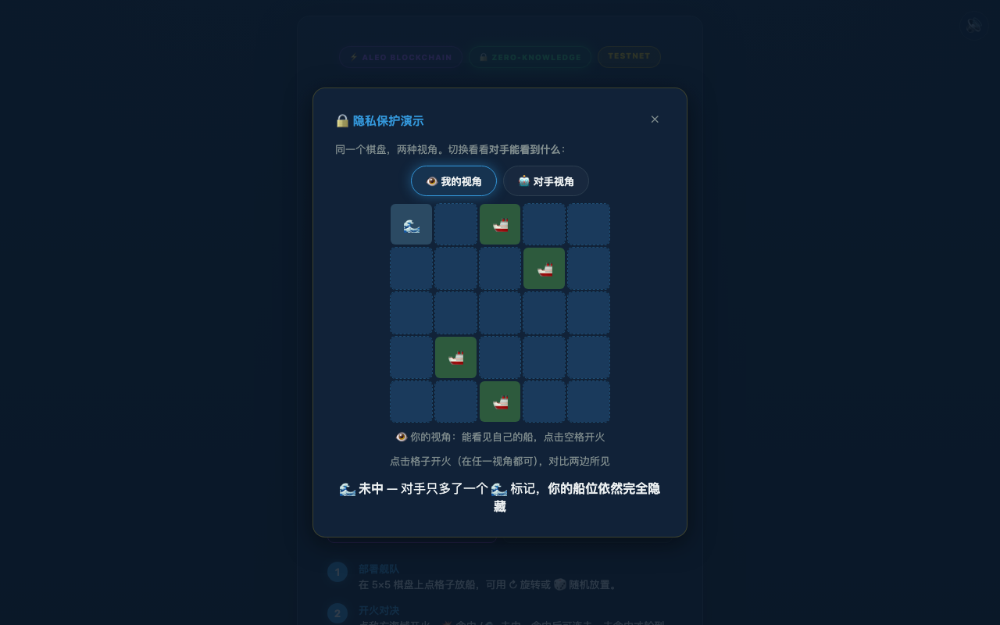
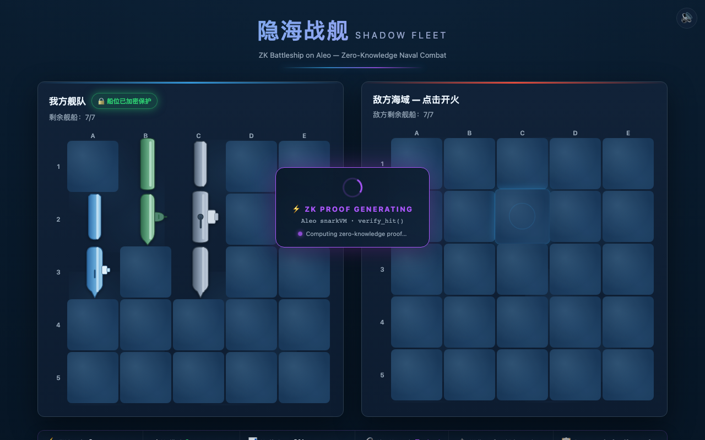
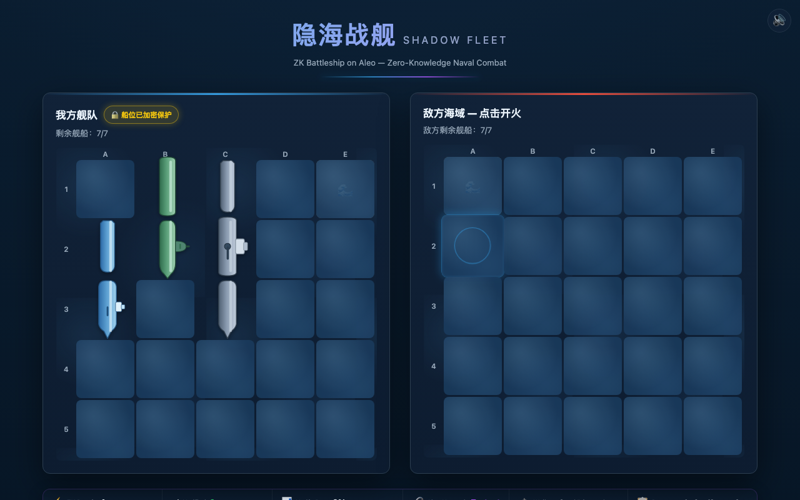

# 隐海战舰 — Shadow Fleet

> ZK Battleship on Aleo — Zero-Knowledge Naval Combat
>
> Built for [Aleo Hackathon](https://hackathon.xyz/events/public/e7ad6199-0078-42ee-9846-b82c385e4c0e) · GameFi & SocialFi Track

[](https://github.com/cpufreestyle/zk-battleship-aleo/blob/main/LICENSE)
[](https://aleo.org)
[](https://developer.aleo.org/leo)
[](https://zk-battleship-aleo-fix.vercel.app)
[](#zk-证明详情--zk-proof-details)
[](#)

**🔗 Live Demo**: https://zk-battleship-aleo-fix.vercel.app

---

## 📸 游戏截图 / Screenshots

| 开始页 — 模式选择 + 战绩面板 | ZK 实验室 — 隐私保护演示 |
|:---:|:---:|
|  |  |

| 战斗中 — ZK 证明 + 区块链状态栏 | 结算 — Blockchain Summary |
|:---:|:---:|
|  |  |

---

## 🎯 项目简介 / What Is This?

**中文**: 隐海战舰是一款隐私保护战舰游戏，战舰位置通过 Aleo 上的**零知识证明**保护。玩家可以验证命中/未命中结果正确，**且永远不暴露**战舰放置位置。

**English**: Shadow Fleet is a privacy-preserving Battleship game where ship positions are protected by **zero-knowledge proofs** on Aleo. Players can verify that hit/miss results are correct **without ever revealing** their ship placements.

---

## ✅ 已部署至 Aleo 测试网 / Deployed on Aleo Testnet

| | |
|---|---|
| **程序 ID / Program ID** | `shadowfleet.aleo` |
| **部署交易 / Deploy TX** | [`at1y8dx5envrqxkna07xhny3eg6fmh9vsy3mz6nc5cenxmtckdm2qqsuesdey`](https://www.aleo.network/) |
| **verify_hit 链上交易 / On-chain TX** | [`at1yal6nvg3t7ukvfe9g7nm48lxe945rj2xp5jr53k5ux0ql9czmcqqrnyxnu`](https://www.aleo.network/) |
| **演示视频 / Demo Video** | `demo.webm` |

---

## 🔐 ZK 隐私原理 / How ZK Privacy Works

```
Player A places ships → ships bitstring (PRIVATE INPUT)
                        ↓
Player B fires at cell → mask (PUBLIC INPUT)
                        ↓
Aleo ZK Program: verify_hit(ships, mask) → ships & mask
                        ↓
ZK PROOF: "The computation is correct" (ships remain ENCRYPTED)
                        ↓
Result: HIT or MISS (PUBLIC OUTPUT)
```

- **Private input**: `ships` (25-bit bitstring of ship positions) — never revealed
- **Public input**: `mask` (which cell was fired at) — visible to both players
- **Public output**: `ships & mask` (non-zero = hit, zero = miss)
- **ZK proof**: Cryptographically guarantees the computation was correct **without exposing `ships`**

---

## 🎮 游戏模式 / Game Modes

| 模式 | 说明 |
|------|------|
| 🤖 **vs AI** | 3 种难度 AI（简单随机 / 普通追踪 / 困难奇偶+智能策略），三局两胜制 |
| 👥 **同设备对战 / P2P** | 两人轮流在同一设备，隐私屏交接，**对方棋盘完全遮蔽** — ZK 证明验证每次开火结果 |
| 🌐 **互联网联机 / Online** | PeerJS (WebRTC) 房间号联机，跨设备对战。**不传输船位明文**，只传输 ZK 证明结果 |

---

## ✨ 核心特性 / Features

### ZK / Web3
| 特性 | 说明 |
|------|------|
| 🔒 **3 个 ZK 函数** | `verify_hit`（命中验证）/ `verify_victory`（胜利验证）/ `verify_scan`（雷达扫描）— Aleo snarkVM 浏览器内真实证明 |
| 🛡️ **三层 ZK 降级** | L1 共享内存探测 → L2 Worker 加载 SDK → L3 本地校验降级，**永不白屏** |
| ⚡ **ZK 证明动画** | 每次开火显示 "ZK PROOF GENERATING → ✓ VERIFIED" 弹窗 + proof hash |
| 📊 **区块链状态栏** | 实时显示 ZK 证明数 / 验证率 / Aleo 钱包 / 程序 ID |
| ⚡ **WebGPU 加速** | 自动检测 WebGPU，GPU 加速 ZK 位运算 |

### 玩法系统
| 特性 | 说明 |
|------|------|
| 🔥 **连击系统** | 命中后继续射击（双方同规则），未命中才换手 |
| 📡 **ZK 雷达扫描** | 每局 1 次，3×3 区域返回战舰数量，**不暴露位置** |
| 🎯 **特殊武器 ×3** | 鱼雷（整行5格）/ 深水炸弹（3×3齐射）/ EMP（封锁对手一回合） |
| 🌫️ **天气系统** | 雾（扫描失效）/ 风暴（命中率惩罚）/ 晴朗 — 随机影响战局 |
| 🚢 **舰船被动技能** | 驱逐舰（战果揭示）/ 潜艇（闪避）/ 护卫舰（快速开火） |
| 🏆 **ELO 排名** | Bronze → Diamond 段位系统，跨局持久化 |
| 🏅 **成就系统** | 首杀 / 三连击 / 五连击 / 完美胜利 / 百发百中 |
| ⚔️ **难度 + 舰队配置** | 3 难度 × 2 舰队（标准3艘 / 扩展4艘） |
| 🎲 **随机放置** | 一键随机部署 |

### 教育
| 特性 | 说明 |
|------|------|
| 📚 **区块链课堂** | 关键时刻弹出知识问答，答对获得游戏奖励（如额外扫描） |
| 🔬 **ZK 实验室** | 可视化演示零知识证明原理 |
| 🃏 **概念卡片** | 通过游戏行为解锁加密知识卡片 |

---

## 🏗 架构 / Architecture

```
zk-battleship-aleo/
├── index.html              # 游戏页面
├── main.js                 # 游戏逻辑 + ZK 证明集成
├── zk.js                   # Aleo SDK 初始化 + 三层降级策略
├── worker.js               # Web Worker（ZK 证明不阻塞主线程）
├── gpu.js                  # WebGPU ZK 加速
├── features.js             # 武器/天气/舰船技能/ELO 系统
├── education.js            # 区块链教育（问答/ZK实验室/概念卡片）
├── net.js                  # 互联网联机（PeerJS/WebRTC）
├── mcp.js                  # MCP AI 战术助手面板
├── state-mcp.js            # 状态桥接
├── audio.js                # 程序化音效引擎
├── fx.js                   # 特效层（震动/爆炸/水波）
├── style.css               # 海战主题 UI
├── vite.config.js / vercel.json
├── deploy.mjs              # Aleo 测试网部署脚本
├── leo/                    # Leo 程序
│   └── src/main.leo       # 3 个 ZK 函数 + 链上 transitions
├── public/                 # coi-serviceworker / headers / icons
├── scripts/                # 构建/预览/打包/录屏脚本
├── demo.webm               # 演示视频
├── DEPLOY.md / PUBLISH.md  # 部署文档
└── start.sh
```

---

## 🚀 快速开始 / Quick Start

```bash
npm install --include=dev
npm run dev        # http://localhost:5173
npm run build      # 产出 dist/（首屏 ~35KB，21MB wasm 懒加载）
```

### 部署到 Aleo 测试网

```bash
# 先从 https://faucet.aleo.org 获取测试网信用
node deploy.mjs <your_private_key>
```

---

## 🔬 ZK 证明详情 / ZK Proof Details

### Aleo Instructions (browser SDK)

```aleo
program shadowfleet.aleo;

function verify_hit:
    input r0 as u32.private;
    input r1 as u32.public;
    and r0 r1 into r2;
    output r2 as u32.private;

function verify_victory:
    input r0 as u32.private;
    input r1 as u32.public;
    and r0 r1 into r2;
    output r2 as u32.private;

function verify_scan:
    input r0 as u32.private;
    input r1 as u32.public;
    and r0 r1 into r2;
    output r2 as u32.private;
```

### Leo Program (`leo/src/main.leo`)

```leo
program shadowfleet.aleo {
    @noupgrade constructor() {}

    fn verify_hit(ships: u32, public mask: u32) -> u32 {
        return ships & mask;
    }

    fn verify_victory(ships: u32, public hits: u32) -> u32 {
        return ships & hits;
    }

    fn verify_scan(ships: u32, public scan_mask: u32) -> u32 {
        return ships & scan_mask;
    }

    // On-chain transitions for multiplayer mode
    fn place_fleet(ships: u32, public ship_count: u8, public opponent: address) -> Board { ... }
    fn fire(board: Board, public coordinate: u32) -> (Board, u32) { ... }
    fn check_victory(board: Board) -> (Board, u8) { ... }
}
---

## 🧠 技术挑战与解决方案 / Engineering Challenges

### 1. 跨源隔离与 WASM 共享内存
**问题**: `@provablehq/wasm` 无条件执行 `new WebAssembly.Memory({shared:true})`，且该行在模块顶层 —— 没有 COOP/COEP 头时静态 import 直接抛错，连带整个页面白屏。

**解决**: 三层降级：
```
L1 能力探测：照 SDK 那行试建最小共享内存
     ├─ 成功 → 继续
     └─ 失败 → coi-serviceworker 合成 COOP/COEP 重载一次
                 ├─ 成功 → L2
                 └─ 失败 → L3 干净降级（游戏照玩，永不白屏）
L2 动态 import SDK → Worker 内跑真 ZK 证明
L3 JS 本地校验
```
> **关键认知**：Chrome 桌面版隐藏了 `SharedArrayBuffer` 全局但**仍允许** WASM 共享内存。判断"能不能跑 ZK"只能用 `new Memory({shared:true})`，不能看 `crossOriginIsolated`。

### 2. ZK 计算不阻塞主线程
**问题**: snarkVM 每次证明冻结主线程数百毫秒~数秒，网页卡死。

**解决**: 所有 `verify_hit / verify_victory / verify_scan` 转发到 Web Worker（`worker.js`），通过 postMessage 收发，主线程始终可响应。worker 初始化也从 9s 宽限到 60s 以覆盖 21MB wasm 冷启动。

### 3. `verify_scan` 的隐私聚合
**问题**: 雷达扫描要告诉玩家 *有几艘船* 却不泄露 *在哪*。

**解决**: ZK 程序对 `ships & scan_mask` 求值，只输出区域内 set-bits **计数**，具体位置不可反推 —— 正是零知识证明"输出聚合信息、隐藏个体信息"的核心应用。

### 4. 三层降级的诚实状态机
保证任何环境下 `?zk=off` 也能完整可玩；状态栏在 加载中/已启用/降级 三态绝不撒谎。

### 5. P2P 与在线对战的隐私
- **同设备对阵**：回合间隐私屏交接，对方棋盘遮蔽，ZK 证明验证顺序结果
- **互联网联机**（PeerJS/WebRTC）：**不传输船位明文**，只交换 ZK 证明结果 —— 对方能验而不能读

---

## 🛠 技术栈 / Tech Stack

| 组件 | 技术 |
|------|------|
| ZK 证明 | Aleo snarkVM (WASM, Web Worker) |
| SDK | @provablehq/sdk |
| GPU 加速 | WebGPU (auto-detected) |
| 链上 | Leo v4.4.1 / Aleo Instructions |
| 联机 | PeerJS / WebRTC DataChannel |
| 前端 | Vanilla JS + Vite 6 |
| 部署 | Vercel (COOP/COEP) |

---

## 📋 Hackathon 提交 / Hackathon Submission

| 项目 | 内容 |
|------|------|
| **赛道** | GameFi & SocialFi |
| **主题** | Programmable Privacy |
| **隐私特性** | 战舰位置是 ZK 程序私有输入 — 可验证但永不泄露 |
| **演示视频** | `demo.webm` |
| **GitHub** | https://github.com/cpufreestyle/zk-battleship-aleo |

---

## 📄 License

MIT
